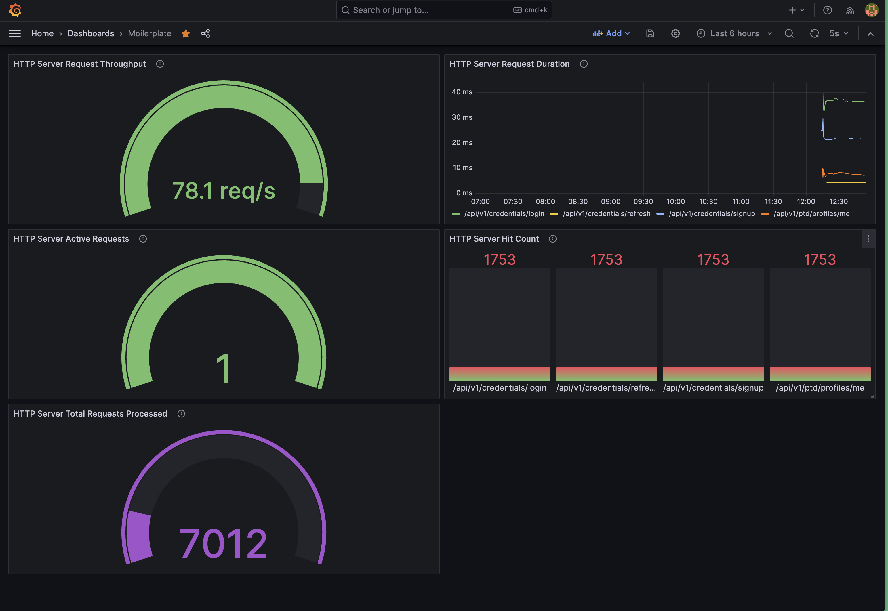
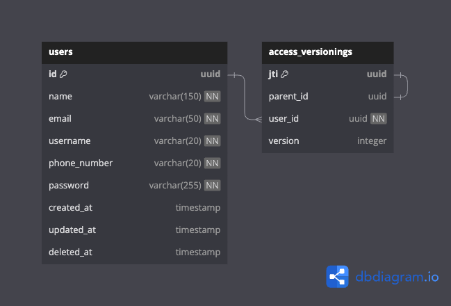

# Moilerplate
> A monolith boilerplate for Golang backend applications built with love.

> [!WARNING]<br> Alpha state

## Table of Contents
- [Introduction](#introduction)
- [Folder Structure](#folder-structure)
- [Getting Started](#getting-started)
  - [CLI](#cli)
  - [Running the server](#running-the-server)
- [What's already included in Moilerplate?](#What's-already-included-in-Moilerplate?)
  - [Security](#security)
  - [Observability](#observability)
  - [Load Testing](#load-testing)
- [Database Design](#database-design)
- [Contributions](#contributions)

## Introduction
Moilerplate is a boilerplate for backend applications built with love. I created this project to serve as a boilerplate for me and or other people to use. Unlike other boilerplates, this one comes with components that you might want to use for your projects. It is also implementing Uncle Bob's Clean Architecture concepts. One of my example project that uses this boilerplate is [SinarLog's backend](https://github.com/SinarLog/backend).

## Folder Structure
- `cmd` consists of bootstraping the app as well as starting the server.
- `config` loading the applications config by reading from .env files.
- `docs` contains swagger documentation.
- `internal` where all the fun begins<br>
  - `internal/domain` stores the domain of the app. I'm trying to follow Domain Driven Design as much as possible here.<br>
  - `internal/delivery` consists of the delivery methods to communicate, like the http endpoints, middlewares, and routers.<br>
  - `internal/utils` consists of application's utility functions, like primitive type manipulations.<br>
  - `internal/app` stores the application layer.<br>
    - `internal/app/usecase` consists of the application logic and orchestration of its infrastructure and service layer.<br>
    - `internal/app/repo` consists of interfaces that the infrastructure layer has to follow.<br>
    - `internal/app/service` consistes of interfaces that the service layer has to follow.<br>
  - `internal/adapter` consists of implementations to fullfil the application's infrastructure and service contracts.<br>
  - `internal/composer` acts as the manager to store all usecase, infrastructure and service layer for easier management.<br>
- `pkg` consists of all external/in-house packages for the application to use. Usually consists of the infrastructure or service initializations.
- `testdata` consists of mocks structs for testing.

## Getting Started
I made Moilerplate to be as customizable as possible, hence it is up to you how you would want to have the application.
#### CLI
Moilerplate has a cli for you to interact with. By running `go run . --help` it will show a list of options you can do.
```bash
go run . --help 
Usage: moilerplate [--version] [--help] <command> [<args>]

Available commands are:
    server    runs the server
```
The `server` command will spin up the server. Below are the available/helpful options for you:
```bash
go run . server --help 

        Usage: server [--with-secure] [--help | -h] [--cert=<cert_path>] [--key=<key_path>] [--env-path=<env_path>]
                      [--mode=<DEVELOPMENT|TESTING|PRODUCTION>]
        Spins up the server...

                --mode            start the server in either DEVELOPMENT, TESTING, or PRODUCTION mode

        If you want to start the server with TLS enabled, these flags might be useful:
                --with-secure     with-secure will start the server using TLS enabled
                --cert            provide with the certificate path
                --key             provide with the key path

        If you want to provide the app to read from provided dot env files, these flags might be useful:
                --env-path        provide with the dot env file path
```
#### Running the server
You may run the server with or without docker. I have provided docker examples for you to play with.

If you want to start without docker, I recommend installing [air](https://github.com/cosmtrek/air) for hot reload as I've provided the `.air.toml` too. I have also provided two docker compose files, one for development (capable of hot reload) and for "production". Personally I recommend starting it using docker compose as it have other components that are integrated too.

Just in case, if you want to enable HTTP/2 for your server, consider using the `--with-secure` option and providing necessary certificates.


## What's already included in Moilerplate?
### Security
I believe that any system available, either available via the internet or not, should have a strong security to protect their users. While I'm building in Moilerplate, I focus a lot in security. So what security is included?

#### Refresh Token reused detection.

Reading an article from OAuth, [link here](https://auth0.com/blog/refresh-tokens-what-are-they-and-when-to-use-them/), it teaches the fundamentals about refresh token. Here in moilerplate, we use versioning to identifies which a refresh token is refering to. To put it short, the versioning works as below:<br>
'*Say that Alice logins in and receives AccessToken_1 and RefreshToken_1. Then at some point of time, Alice's AccessToken_1 is expired and ask for a new access token using RefreshToken_1. With that, now Alice has AccessToken_2 and RefreshToken_2. Then let's assume that there is a hacker X who stole Alice's RefreshToken_1. This hacker X then ask for a new access token with RefreshToken_1. Since we know that RefreshToken_1 has been used, the system will delete all the versioning of this token's "family". Which will require both Alice and hacker X to re-login to obtained they're access token. With this, the hacker then needs to know Alice's password for that.*'
Now, it might not be as sophisticated as other system, but this is the basic security that all application should provided.

### Observability
As mentioned, I have provided the docker compose files which has the observability stack components to it. Furthermore, Moilerplate is already integrated with observability capabilities. Upon starting the projects using docker compose, you can head to:
- [localhost:16686](localhost:16686) for the Jaeger tracing,
- [localhost:9090](localhost:9090) for Prometheus metrics,
- [localhost:3000](localhost:3000) for Grafana.
- [localhost:9094](localhost:9094) for Cassandra (able to CQLSH to the container)

Make some API calls, and start building your dashboard in Grafana. Here is an example dashboard I've built in Moilerplate.



If you want to have this exact same dashboard, here are the PromQLs:
- Request per second:
```promql
sum(rate(http_server_request_count{job="collector"}[1m]))
```
- Active request:
```promql
sum(http_server_active_requests)
```
- Total request:
```promql
sum(http_server_request_count)
```
- Hit by API Route:
```promql
sum(http_server_request_count{job="collector"}) by (http_route)
```
- Request duration by API:
```promql
histogram_quantile(0.99, sum(rate(http_server_request_duration_bucket{job="collector"}[1d])) by (le, http_route))
```

### Load Testing
Inside the folder `testing/load_testing` there exists a k6 script load test files written in JavaScript that can be use to load test Moilerplate. Please read through [k6](https://k6.io/) documentation page on how to write and setup.
For a simple try, assuming you have installed, you ma run
```bash
k6 run --vus 10 --duration 30s testing/load_testing/k6_user_test.js
```

## Database Design
Here are the entities that are currently on Moilerplate.


I have also provided `database.dbml` for you to document your ERD if there are any changes. Head to [dbdocs](https://dbdocs.io/) for this tool.

## Contributions
Moilerplate is open to suggestion and feel free to raise a PR.

***Last but not least, I hope you enjoy using Moilerplate and always modify this boilerplate to fit your usecase!***
